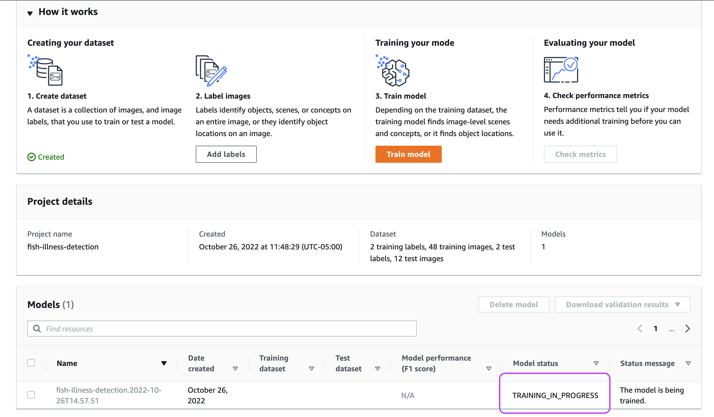
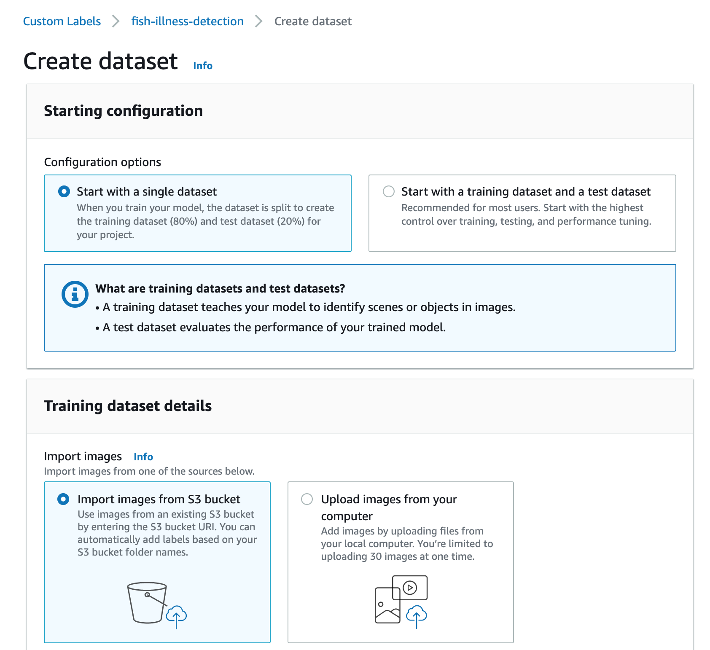
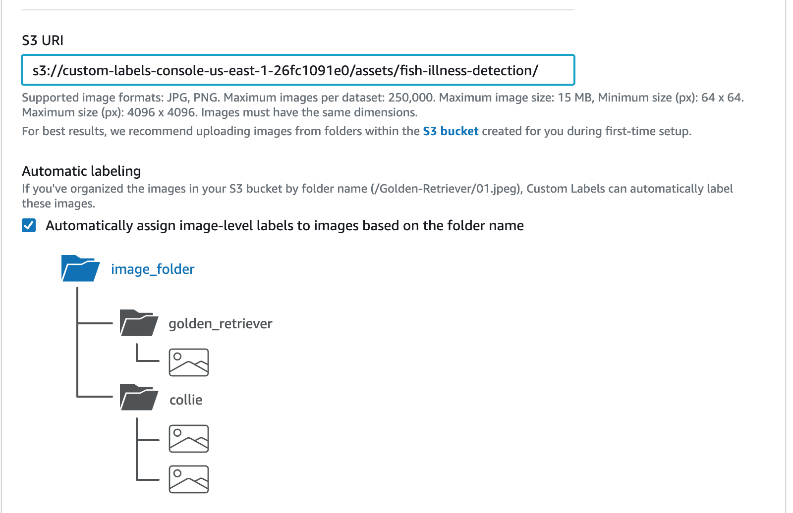
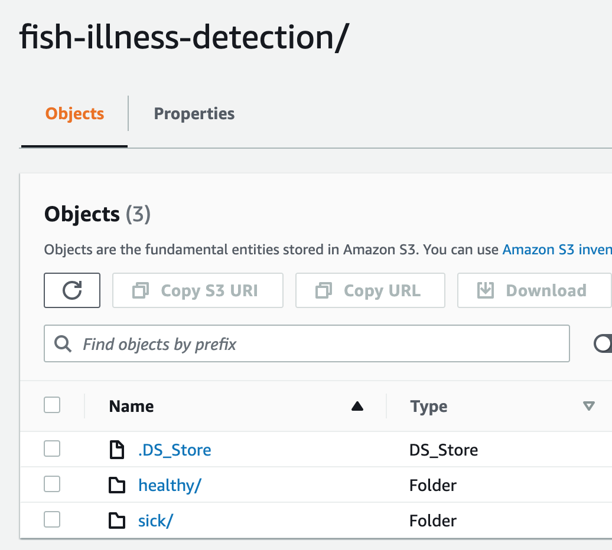
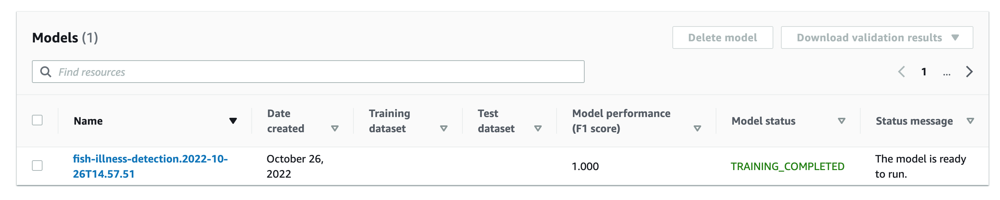
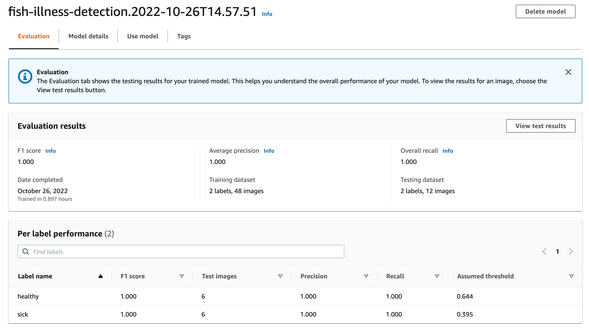
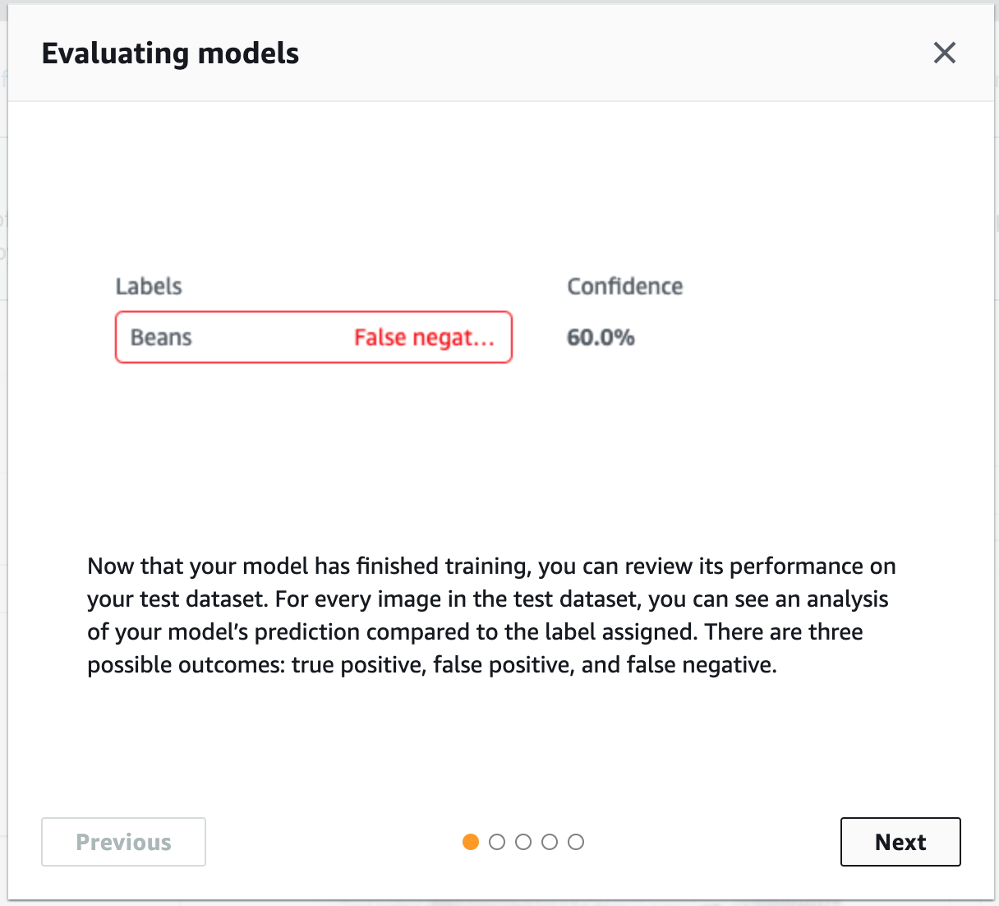
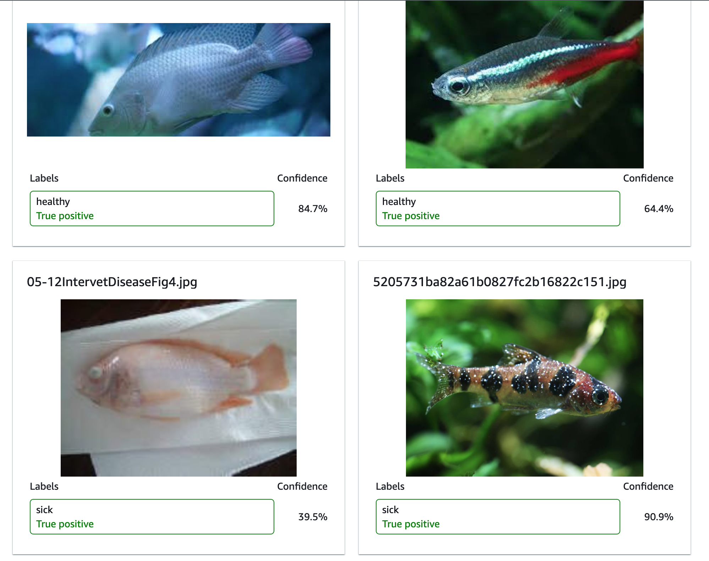
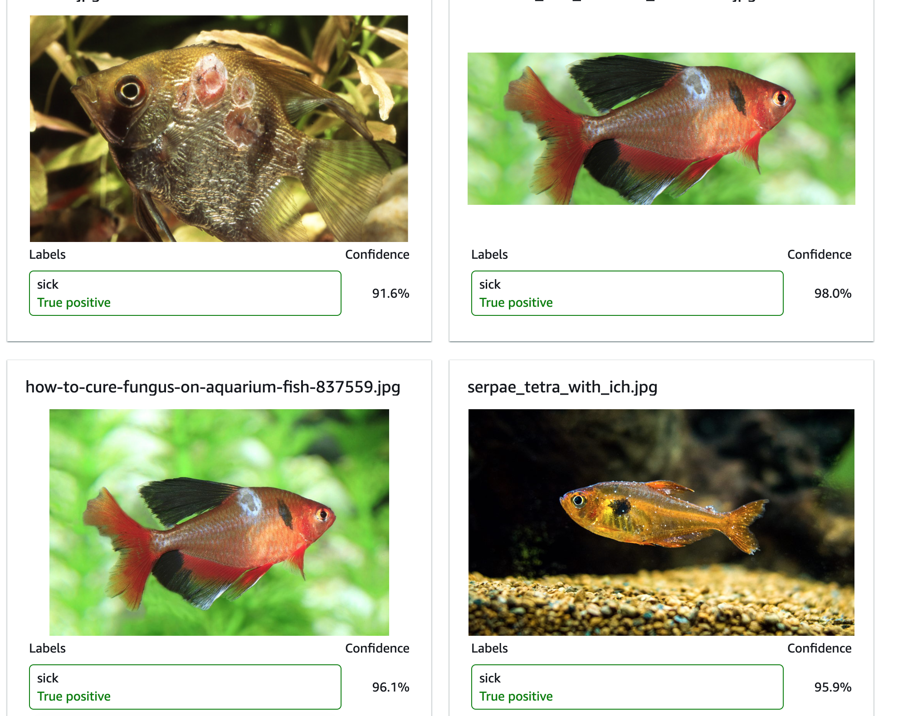
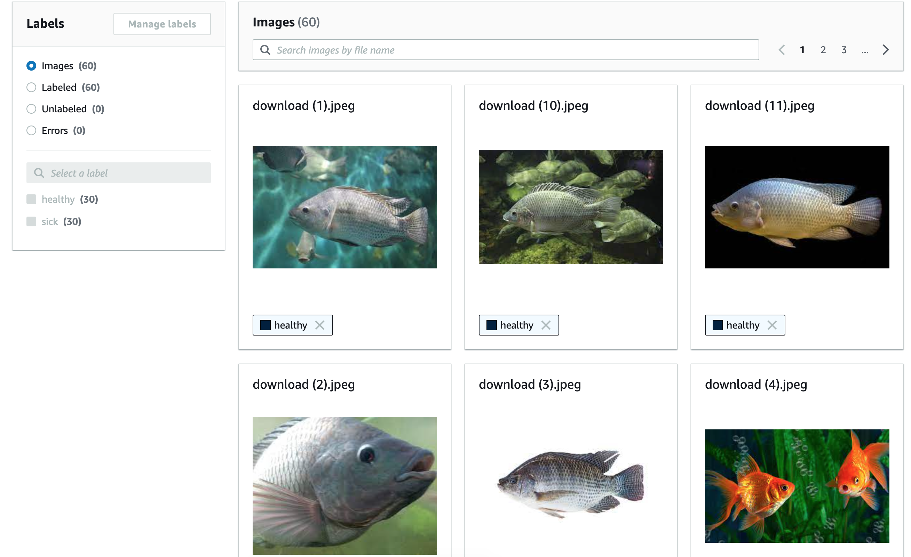

# Diagnóstico de un pez enfermo
- https://pharmaq.com/es/pharmaq/enfermedades-de-los-peces/la-tilapia/#:~:text=La%20tilapia%20y%20sus%20enfermedades&text=Los%20brotes%20de%20enfermedades%20bacterianas,de%20la%20Tilapia%20del%20Lago.
- https://www.veterinariadigital.com/en/articulos/production-of-tilapia-worldwide-and-most-important-diseases/

# Enfermedades que se pueden detectar por el análisis de imágenes
> Cual es la enfemedad mas común en Colombia?
> Cual es la que mas afecta la producción, (Pareto)

## Viral
- Tilapia-Lake Disease virus (TiLVD)
- Infectious Spleen and Kidney Necrosis virus (ISKNV)
- Lymphocystis Disease virus (LCDV)

## Bacterial
- Streptococcus spp.
- Francisella spp.
- Edwarsiellosis

## Parásitos
> Son más dificiles de detectar
- Mycotoxicosis

# Observacion de peces como
- Nada
- Respira
- Come
- Interactua con otros peces

# Diagnóstico de un pez enfermo

## Análisis de imagen
- Tiene aletas cortadas
- Tiene llagas
- Ojos inflamados, hinchados, saltones
- Vientre inchado
- Vientre hueco
- Heridas o cortes puede ser victima de otros peces
- Diferencia en la apariencia entre las escamas
- Escamas levantadas
- Putrefacción aletas, mas cortas
- Deformidades en el cuerpo
- Puntos blancos
- Ojos nublados
- Aletas deshilachadas

## Análisis video
- Esta escondido
- Las aletas o colas pueden agrupadas o cerradas
- Aletas pegadas el cuerpo
- Natacion y balanceo errático
- No tiene apetito
- Problemas para nadar
- No se puede mantener derecho
- Nadar de lado
- Acumulacion de comida no aprovechada: permite la proliferación de bacterias, toxinas y contaminación del agua (muertes masiva)

## Análisis comportamiento
- El pez esta cerca de la superficie jadeando por respirar: probable falta de oxigeno, mala circulación del agua, agallas dañadas, toxinas en el agua
- El pez esta escondido: compañeros muy agresivos
- El estres disminuye su sistema inmunologico
- El pez parece no apetente, devuelve la comida
- El pez se ubica en el fondo del estanque por largos periodos de tiempo y no se mueve (aletargado)
- El pez se rasca su cuerpo con el estanque 
- El color del pez se torna palido o gris

# Prueba Etiquetar un pez Enfermo o Sano
> Para establecer enfermedades de los basado en el comportamiento de los peces necesitamos hacer el seguimiento de los mismos

## Proceso

## Dataset (Conjunto de datos)
- Para entrenar el modelo se definió dos etiquetas: healthy 30 imágenes y sick también con 30 imagénes
- Las imágenes fueron tomadas de los resultados de búsqueda de google
- La imágenes se subieron a un repositorio de AWS-S3

## Entrenamiento

### Entrenamiento
-  El proceso de entrenamiento depende del numero de imágenes que se le provea
-  Se pueden realizar reentrenamiento con mayor numero de imágenes
-  El proceso puede ser mayor a 30 minutos 

### Precisión
- Cuando se hacen los primeros entrenamiento la precisión y confidencia es bajo
- A medida

### Evaluación de los modelos
> Hay tres tipos de resultados:
- **true positive** es un pez enfermo, o es un pez sano
- **false positive** no es un pez enfermo, pero por una mancha de luz en la imagen del pez determino que esta enfermo
- **false negative** no es un pez y no esta enfermo

## Resultados

