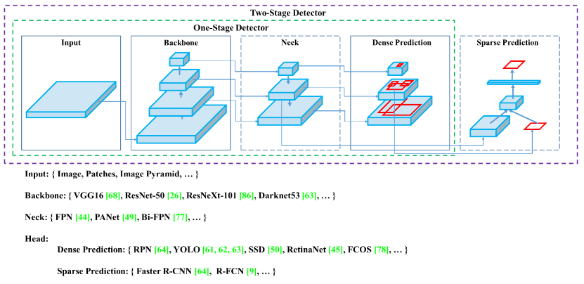
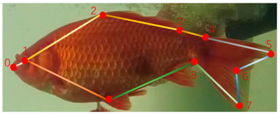
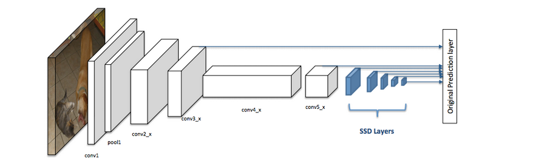
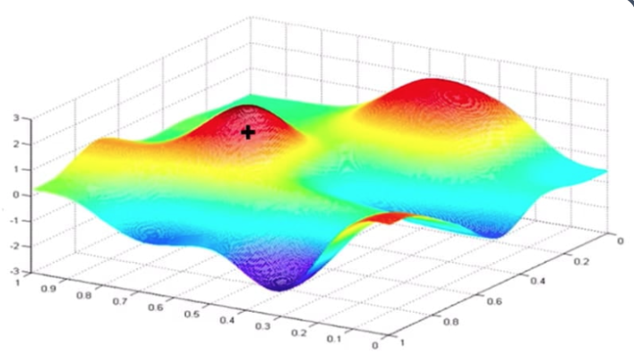
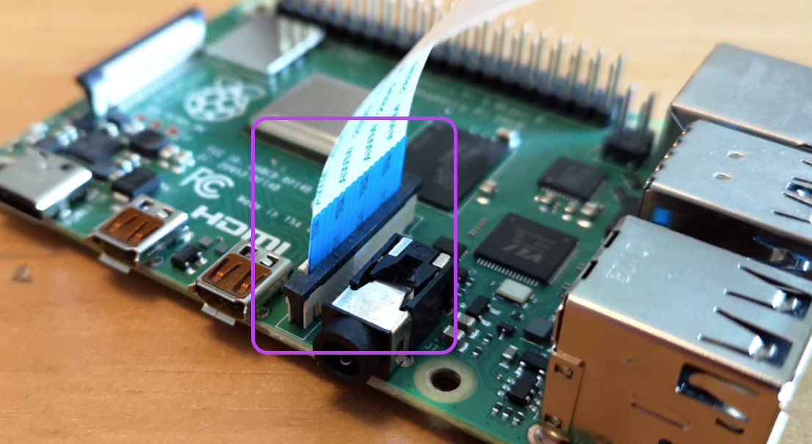

# ANEXO_7 Seguimiento de objetos en un video (Video Frame Object Tracking) 
> El objetivo principal es hacer el seguimiento individual de los peces y registrar la posición espacial (x, y, z), para determinar patrones de comportamiento de los peces.


# Referencias

## AWS
- Documentación a implementar: https://docs.aws.amazon.com/sagemaker/latest/dg/sms-video-object-tracking.html 
- https://aws.amazon.com/blogs/machine-learning/streamlining-data-labeling-for-yolo-object-detection-in-amazon-sagemaker-ground-truth/
- https://docs.aws.amazon.com/sagemaker/latest/dg/sms-video-ot-worker-instructions.html
- https://www.youtube.com/watch?v=hxevV_EFqm8
- https://docs.aws.amazon.com/rekognition/latest/dg/streaming-labels-setting-up.html
- https://somewes.com/frame-count/
- https://docs.aws.amazon.com/sagemaker/latest/dg/sms-data-output.html
- https://docs.aws.amazon.com/sagemaker/latest/dg/sms-video-object-detection.html#sms-video-od-create-labeling-job
- https://docs.aws.amazon.com/sagemaker/latest/dg/sms-video-object-tracking.html
- https://www.veed.io/video-compressor?_


# Open source
- https://ai.plainenglish.io/five-unbelievable-open-source-object-detection-projects-e851f4c89654
- https://opensource.com/article/20/1/object-tracking-camera-raspberry-pi
- https://medium.com/analytics-vidhya/best-open-source-and-free-custom-object-detection-python-repositories-libraries-3595446857e

## YOLO
- https://aws.amazon.com/blogs/machine-learning/improving-performance-for-deep-learning-based-object-detection-with-an-aws-neuron-compiled-yolov4-model-on-aws-inferentia/
- https://medium.com/hackernoon/building-realtime-object-detection-api-with-amazon-sagemaker-and-amazon-api-gateway-c9f62a9fd69a#id_token=eyJhbGciOiJSUzI1NiIsImtpZCI6IjI3Yjg2ZGM2OTM4ZGMzMjdiMjA0MzMzYTI1MGViYjQzYjMyZTRiM2MiLCJ0eXAiOiJKV1QifQ.eyJpc3MiOiJodHRwczovL2FjY291bnRzLmdvb2dsZS5jb20iLCJuYmYiOjE2Njg3NzI1OTMsImF1ZCI6IjIxNjI5NjAzNTgzNC1rMWs2cWUwNjBzMnRwMmEyamFtNGxqZGNtczAwc3R0Zy5hcHBzLmdvb2dsZXVzZXJjb250ZW50LmNvbSIsInN1YiI6IjEwMjc0MTc1NjAzNDkyMzAwNTQ5MyIsImVtYWlsIjoicm9iaW44YUBnbWFpbC5jb20iLCJlbWFpbF92ZXJpZmllZCI6dHJ1ZSwiYXpwIjoiMjE2Mjk2MDM1ODM0LWsxazZxZTA2MHMydHAyYTJqYW00bGpkY21zMDBzdHRnLmFwcHMuZ29vZ2xldXNlcmNvbnRlbnQuY29tIiwibmFtZSI6IlJvYmluIE9jaG9hIiwicGljdHVyZSI6Imh0dHBzOi8vbGgzLmdvb2dsZXVzZXJjb250ZW50LmNvbS9hL0FMbTV3dTE5TG50ZXJMenhGWlVpcHhod2xvWnh0YkRncC1qTTktRnd6NS1xSVpFPXM5Ni1jIiwiZ2l2ZW5fbmFtZSI6IlJvYmluIiwiZmFtaWx5X25hbWUiOiJPY2hvYSIsImlhdCI6MTY2ODc3Mjg5MywiZXhwIjoxNjY4Nzc2NDkzLCJqdGkiOiI5OTJjZjI0YTRjNzMxYjNjNzViZWQ4YWZlOWRmZWZlMzJlOWMzNDM3In0.qd9drs-3iMa_RhNo5fHL_WdfOudzlHJM2IOyEZydGHPhgGBBUhbAFuokEQ-ekC0cO4GhiOaYQ_lWx-RG---rldEYdl3h7YBBUSzyaGgzlxKjJyya-ym9s-FCk56Kwqkn-IIcko9HhuIT29lFaO3u97pGW1je2pIOliWWespGI-3eH_zJqclHVPcOLsGUki1E4rpSAJbI6gWv5gTPG36ddfAbJvzZm0hm6w9S4bEfjoRGdHXFpeYdJlueEu1CppF1oqE5gm7Prr7Jf_IK365TV3YQoec-8czbfD5mu__pvwa8rL8-ttXaVkl1BLim5BQzt1F9j-AObRp0EhDFXDr24Q

## Otros
- [Automatic fish species classification in underwater videos: exploiting pre-trained deep neural network models to compensate for limited labelled data](https://academic.oup.com/icesjms/article/75/1/374/3924506)
- https://www.researchgate.net/publication/228811247_Malware_Images_Visualization_and_Automatic_Classification

## Ejemplo


# ANEXO_8 Seguimiento

## Referencias
- https://ai.plainenglish.io/five-unbelievable-open-source-object-detection-projects-e851f4c89654
- https://opensource.com/article/20/1/object-tracking-camera-raspberry-pi
- https://medium.com/analytics-vidhya/object-detection-algorithm-yolo-v5-architecture-89e0a35472ef
- https://www.mdpi.com/2410-3888/6/4/65/htm
- https://www.infoworld.com/article/3278008/what-is-tensorflow-the-machine-learning-library-explained.html
- https://www.tensorflow.org/resources/learn-ml/theoretical-and-advanced-machine-learning
- http://introtodeeplearning.com/
- http://introtodeeplearning.com/slides/6S191_MIT_DeepLearning_L3.pdf
- https://opencv.org/
- https://store.opencv.ai/ HW
- https://medium.com/analytics-vidhya/best-open-source-and-free-custom-object-detection-python-repositories-libraries-3595446857e
- https://www.analyticsvidhya.com/blog/2021/09/some-amazing-applications-of-opencv-library/#:~:text=OpenCV%20is%20a%20great%20tool,including%20python%2C%20java%20C%2B%2B.
- https://medium.com/srcecde/opencv-with-aws-lambda-via-layers-27592696c32a
- https://medium.com/analytics-vidhya/what-and-why-opencv-3b807ade73a0
- https://www.analyticsvidhya.com/blog/2021/08/getting-started-with-object-tracking-using-opencv/
- https://pyimagesearch.com/2018/11/12/yolo-object-detection-with-opencv/
- https://www.folkstalk.com/tech/opencv-google-colab-with-code-examples/
- https://www.youtube.com/watch?v=NFDqFPs5x9o
- https://www.avenga.com/magazine/top-cloud-service-providers/


## 1. Introducción
Este documento tiene como objetivo establecer las tecnologías, algoritmos y pruebas para el seguimiento de objetos (peces), con los pilares principales: **portabilidad**, **escalabilidad** y **costo bajo**. Lo anterior como insumos para el entrenamiento de los modelos preventivos y reactivos basado en el comportamiento de los peces. Por cada pez se va a guardar la posición X, Y, Z durante un periodo t (tiempo), respecto a un punto de referencia K

## 2. Tecnologias opensource o código abierto
La detección y seguimiento de objetos es una tecnología de visión computacional, procesamiento de images y videos, deep learning, algoritmos de Machine learning. 
- Para construir aplicaciones con Python, OpenCV, Tensorflow, Keras. 
- Algoritmos o frameworks como: RetinaNet, YOLOv3, TinyYOLOv3 y conjunto de datos como COCO, Kitti Object Detection Dataset, Single-shot detector, PyTorch
- Hardware: Raspberry Pi con PiCameraV2: es un mini computador que se usa para realizar pruebas de prototipos ya que cuenta con el sistema operativo Linux (Debian o Ubuntu) para la instalación de las librerias y programas necesarios para las tareas de detección y seguimiento de objetos. Adicionalmente cuenta con el modulo de cámara nativa Sony IMX219 8-megapixel


### YOLO (You Only Look Once)
- Para la implementación de un sistema de seguimiento de peces local con sistemas portatiles con poco recursos computacionales (CPU/RAM) con un alto rendimiento se usará YOLO
- YOLO es una abreviatura del término 'You Only Look Once'. Este es un algoritmo que detecta y reconoce varios objetos en una imagen (en tiempo real). La detección de objetos en YOLO se realiza como un problema de regresión y proporciona las probabilidades altas de clasificación de las imágenes detectadas. 



### COCO conjunto de datos
- El objeto común en contexto (COCO) es uno de los conjuntos de datos de imágenes etiquetadas a gran escala más populares disponibles para uso público. Representa un puñado de objetos que encontramos a diario y contiene anotaciones de imágenes en 80 categorías, con más de 1,5 millones de instancias de objetos
- Es una libreria versatil y multiproposito para diferentes escenarios para el entrenamiento de modelos
- 287.135 imágenes
- Detección de puntos clave: COCO brinda acceso a más de 200 000 imágenes y 250 000 instancias de personas etiquetadas con puntos clave.
  
- COCO es un conjunto de datos de subtítulos, segmentación y detección de objetos a gran escala. COCO tiene varias características:

- Segmentación de objetos
- Reconocimiento en contexto
- Segmentación de cosas de superpíxeles
- 330K imágenes (>200K etiquetadas)
- 1,5 millones de instancias de objetos
- 80 categorías de objetos
- 91 categorías de cosas
- 5 subtítulos por imagen
- 250.000 personas con puntos clave

### Single-shot detector (SSD)
- SSD es un tipo de arquitectura CNN especializada para la detección, clasificación y localización de cuadros delimitadores en tiempo real.

- Arquitectura de una red neuronal convolucional con un detector SSD, fuente: 

### TensorFlow: 
- TensorFlow es una biblioteca de código abierto compatible con Python para el cálculo numérico que hace que el aprendizaje automático y el desarrollo de redes neuronales sean más rápidos y sencillos.
- Permite a los desarrolladores crear gráficos de flujos como nodos o series para ser procesados, cada nodo representa una operación matemática y cada conexión es un arreglo multidimensional o **tensor**

- Función de costo, fuente: Tensorflow.org
- Potente experimentación para la investigación.

### OpenCV
- Es una biblioteca de funciones de programación destinada principalmente a la visión artificial en tiempo real. Desarrollado originalmente por Intel, luego fue respaldado por Willow Garage y luego por Itseez. La biblioteca es multiplataforma y de uso gratuito bajo la licencia **Apache 2 de código abierto**
- Es una gran herramienta para el procesamiento de imágenes
- Se instala en diferentes sistemas operavit (Linux, Windows, Android, Mac-OS)
- Soporta diferentes lenguajes de programación como Python

> Aplicaciones:
- Kits de herramientas de características 2D y 3D
- Estimación de egomoción
- Sistema de reconocimiento facial
- Reconocimiento de gestos
- Interacción humano-computadora (HCI)
- Robótica móvil
- Comprensión de movimiento
- Identificación de objetos
- Segmentación y reconocimiento
- Stereopsis stereo vision: percepción de profundidad a partir de 2 cámaras
- Estructura del movimiento (SFM)
- rastreo de movimiento
- realidad aumentada

### Red neuronal convolucional: CNN 
- Es un tipo de arquitectura de red neuronal que se adapta bien a las tareas de clasificación de imágenes y detección de objetos.


## 3. Pruebas Procesamiento en la nube para el seguimiento de peces (nube/local)
> Definir cual es la solución mas optima para el procesamiento los videos localmente o subir los datos a la nube, teniendo en cuenta costos, escalabilidad y portabilidad. Se realizarán pruebas con los 3 servicios de la nube mas populares: Amazon Web Services (AWS), Microsoft Azure y Google Cloud. También se harán pruebas con Raspberry Pi y librerias opensource para una solución local (en sitio), donde los datos crudos se transmitiran a la nube para ser procesados y entrenamos para determinar el comportamiento de los peces en los tanques.

## 3.1 Prueba en la nube con AWS
1. Comprimir los videos: para un mejor rendimiento del procesamiento los videos deben estar comprimidos
2. Subir los videos a la nube: se debe hacer de forma automática
3. Definir los tiempo de captura 

4. Bounding Box (Seguimiento) / Key point (Proporciones)

5. Definicion manual de cada uno de los peces para su seguimiento y etiquetado


## 3.2 Prueba - local con Raspberry Pi y PiCamera V2
> Haciendo uso de raspberry pi y YOLO (Yoy only look once), como prueba de un equipo con los minimos recursos tanto de energía como de procesamiento para la instalación en sitio

1. Instalacion de hardware y puesta en marcha del equipo y la cámara

2. Instalación y configuración  
- Linux Debian
- Python
- OpenCV
- Yolo
- Tensoflow
- Tensoflow Lite
- Single Shot Detection
3. Pruebas funcionales con video en tiempo real
- Pruebas inciales detecta humanos y algunos objetos del entorno
- Se debe entrenar el modelo para el seguimiento de peces


# Comportamientos
- Debemos contar con las trayectorias x, y, z que hace un pez cuando tiene hambre (clicos de apetencia)
- Debemos contar con las trayectorias x, y, z que hace un pez cuando esta en un ciclo reproductivo
- Debemos contar con las trayectorias x, y, z que hace un pez cuando esta enfermo


# Tutoriales
- [Index](https://aws.amazon.com/sagemaker/getting-started/)
- [Tutorial completo de etiqueta de objetos](https://aws.amazon.com/getting-started/hands-on/machine-learning-tutorial-label-training-data/)
- https://docs.aws.amazon.com/sagemaker/latest/dg/howitworks-nbexamples.html
- https://docs.aws.amazon.com/sagemaker/latest/dg/sms-getting-started-step1.html


# 
```sh
aws rekognition detect-custom-labels \
  --project-version-arn "arn:aws:rekognition:us-east-1:036134507423:project/fish-illness-detection/version/fish-illness-detection.2022-10-26T14.57.51/1666814271805" \
  --image '{"S3Object": {"Bucket": "kiosuancultivosacuic6b8f0ee9fcbe45a9803254d820f65546-dev","Name": "fish_001.jpeg"}}' \
  --region us-east-1
```


# Rekognition
- https://boto3.amazonaws.com/v1/documentation/api/latest/reference/services/rekognition.html
- https://docs.aws.amazon.com/rekognition/latest/customlabels-dg/ex-lambda.html


```sh

python client.py function_name s3://bucket/path/image.jpg

s3://kiosuancultacuicv2bb5d71c6f2fe40ffaad66a34b8c47115340-dev/public/appetite_prediction/0010.png

```


- https://gist.github.com/Adobe-Android/7825cda6949a9fa55cd5707d8f3a5e28