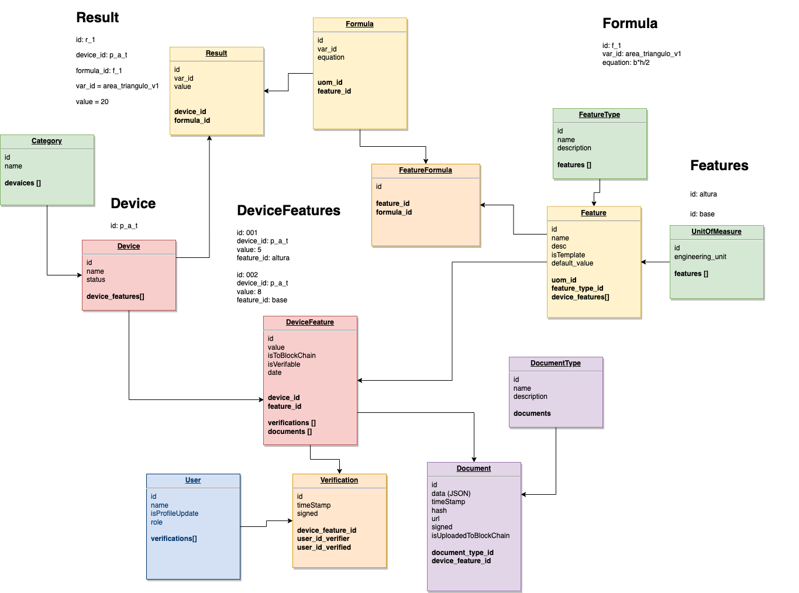

# Referencias
- https://colombiatic.mintic.gov.co/679/articles-124767_recurso_1.pdf
- https://app.cloudcraft.co/
  
# ANEXO_001 Arquitectura de Hardware/Software

## Captura de datos
### Raspberries Pi: 
- Dos rapberries Pi
- Capacidad de conexión a red movil (3G/4G) y Wifi (Redundacia)
- Doble tarjeta de red; una para Wifi y otra para que funciones como server y hotspot de otros dipositivos
- Interfaz offline servidor para descargar datos localmente en caso que no haya conexión de Internet
- Solución de energía (baterías, supresor de picos, apagado automático)
- Extraer, Tranformar, Cargar  y enviar los datos a través de MQTT IoT de AWS (pub/sub)
- AWS SQS para el encolamiento y gestión de  (*posible)

### Granja de dispositivo (IoT): 
- Conjunto de equipos que se integran a los raspberries Pi para enviar datos
- Ej. camaras, dispositivos de medición, formularios
- Parametros ambientales y calidad del agua (PH, temperatura, oxigenación, etc)

## Base de datos y archivos multimedia
- Funciones Lambda de AWS que se dispara con un Evento de IoT de los raspberries y guarda la información a través de un API (AppSync) en una Base de datos no relacional (DynamoDB) 
- Fuente de datos para entrenar los modelos de aprendizaje (ML (Machine Learning))
- Fuente de datos para el frontend de la aplicación Webapp
- Correlación de mensajes de IoT con archivos multimedia (imágenes/video) para ser usados en el entrenamiento y "estado actual" del estanque

## Frontend
### Autenticación y autorización
- Cognito: Gestión de usuario, autenticación y autorización
### API
- Queries, Mutaciones (CRUD), Suscripciones (onCreate, onUpdate, onDelete)
- Graphql
- AWS AppSync

### Almacenamiento
- Amazon (S3 Simple Storage Service) para guardar los archivos

## Entrenamiento de modelos con datos y multimedia (Sagemaker)
- Con los datos de la base de datos entrenar los modelos
- Crear los algoritmos
- Procesar la imágenes
- Interpretar la imágenes
- Identicar imágenes

# ANEXO_2 Modelo Entidad Relación

> En orden de importancia: 

## Device
- Son los dispositivos que están categorizados (Ejemplo: Capturas de video, Mediciones de Equipos, Mediciones Manuales)

## Feature
- Se pueden crear (1 a n) features
- Son las (caracteristicas, medidas, documentos, variables, etc) que se pueden asociar a un dispositivo
- Se les asocian unidades de medida (m, kg, m2, densidad, saturación_oxigeno etc)
- Un usuario puede verificar un feature y su documentación asociada

# Formulas
- Se crean fórmulas para realizar calculos especificos sobre variables 
- Se pueden tener diferentes versiones de la formulas y cálculos de las mismas
- Ecuaciones paso a pasa de resultados previos, y con ellos realizar un nuevo cálculo

# Document
- Asociado un dispositivo
- Categorizado 

# ANEXO_3 Automatización 
- Automatizar de la granja
- Cuanto pesa mi pez? 
- Comida entregada vs proteina en el pez
- Sustentable y economico
- Camara para detectar el tamanho y salud de pez (computing vision)
- Determinar cuando y cuanto se puede vender la producción
- Reproducir las condiciones ideales para el desarrollo de la acuicultura (IA) 
- Aumento de la productividad al mejorar la eficiencia alimentaria y el manejo de enfermedades en sus primeros estados 
- Favorece el muestreo de los peces al evitar estrés por la intervención permanente dentro de los estanques

> Que algoritmos vamos a implementar para lograr los puntos anteriores: 

# Algoritmos a entrenar:
> A traves del procesamiento de imágenes y entrenamiento de modelos de aprendizaje, se propone implementar:

## Algoritmo crecimiento
- Teniendo en cuenta las mediciones de los instrumentos como: (Temperatura, Oxigeno, Profundidad, Claridad del agua, etc)
- Determinar mortalidad
- Enfermedades
- Crecimiento
- Conversión alimenticia  gramos de comida en gramos de peso del pez (gramos_comida/gramos_pez)

## Algoritmos para determinar si es un pez y corte(crop) la imagen
- Identificar y aislar la imagen de un pez
- 
- Dejar en cuadro el pez
- 
  
## Algoritmos para filtrado 
- Eliminar las imagenes difusas, o no claras o oscuras
  
## Algoritmos identificación 
- Identificar las partes de pez (aletas, cabeza, otras partes)
- 
- Determinar con las proporciones y correlación el tamanho del pez

## Algoritmos para determinar si un pez esta enfermo
- Deteccion de parasitos? Determinar el impacto de enfermedades en porcentaje en perdida de produccion, disminuir el trabajo de los granjero de tomas manuales
- Identificar manchas
- Identificar parásitos
- Con la deteccion de enfermades o parasitos. Mejores estrategias de prevencion de enfermedades; que porcentaje es %?

## Algoritmos identificación de comportamiento
- Nivel de flotabilidad

## Algoritmo para determinar el peso
- Como referencia un plano en 3D determinar la proporciones y peso
  
## Algoritmo para identificar individualmente cada pez
- Realizar el conteo con reconocimiento facial de un pez, cada pez tiene la cara unica (manchas), o manchas en el cuerpo
- Seguimiento del origen del pez con Blockchain trazabilidad del criador a la mesa
  
## Algoritmos para contar los pellets de comida y cuantos se van al fondo
- Cuanto es el porcentaje de costo de la comida?
- De lo pellets de alimentacion cuanto se aprovecha

# Fuentes de datos (Entrenar para los algoritmos)
- Mediciones de los dispositvos
- Imágenes procesadas y filtradas
- Videos
- Mediciones de campo

# Servicios AWS AI/ML (Machine Learning) 
- Amazon Transcribe
- Amazon Polly
- Rekognition (x)
- Amazon Forecast (x)
- Amazon Lex
- Amazon Personalize

# ANEXO_4 AI (Inteligencia Artificial) y ML (Machine Learning)
> Macro procesos y subprocesos que se llevan a cabo para resolver un problema o caso de uso de machile learning

## Establecer la verdad fundamental
- No contamos con datos entrenados y necesitamos que primero sea generado por humanos Ej. las trayectorias que siguen los peces cuando tienen hambre, o cuando están en un cilo reproductivo o donde permacenen cuando están enfermos
- Entrenar un modelo de clasificacion de imágenes de enfermedades, necesitamos etiquetar una cantidad considerable de imagenes antes de entrenar la red neuronal. Para nuestro casos de uso vamos a probar los modelos 

# Ingeniería de Datos (ETL)
- Extraer => Transformar => Cargar ETL
- Almacenar => Transformar => Transmitir => Flujos de trabajo
- Creación de los repositorios de ML (Machine Learning)
- Identificar e implementar la solución de ingestion de datos
- Identificar e implementar la solución de transformacion de datos

 
## Almacenar
- S3 Data lakes: repositorio de archivos planos (csv, json)
- DynamoDB: Base de datos no relacional

### Ciclo de vida de los datos
- No es necesario definir en esta etapa un ciclo; con el objetivo de disminuir los costos de almacenamiento
- Stardard Availability 99.99%, AZs >=3, Costo por 1000 request GET: $0.0004 POST: $0.005 USD
- S3 tiene un durabilidad de 99.99999999999 == (11 9's)

## Transformar
> A través de un servicio serverless ETL (Extraer, Transformar, Cargar) fuentes datos a un objetivo o servicio de AWS
- Glue ETL (Extraer, Transformar, Cargar)

## Transmision
> El procesamiento de video e imágenes trasmitidos un servicio de transmisión de datos en tiempo real escalable y duradero que puede capturar de forma continua gigabytes de datos por segundo:
- Kinesis
- Kenesis Video transmision, se usara principalmente 

## Flujos de Trabajo (Workflows)
> AWS Data Pipeline es un servicio web que lo ayuda a procesar y mover datos de manera confiable entre diferentes servicios de computación y almacenamiento de AWS, así como fuentes de datos locales, a intervalos específicos. O a través de lotes (Batch), ó Funciones paso a paso.
- Data pipelines
- AWS Batch
- Funciones paso a paso

# Análisis Exploratorio de Datos
- Limpiar y preparar los datos para el modelo
- Realizar ingeniería de características
- Analizar y visualizar los datos para ML (Machine Learning)

## Ciencia de Datos
- Scikit Learn: "Scikit-learn es una biblioteca de aprendizaje automático de software libre para el lenguaje de programación Python. Cuenta con varios algoritmos de clasificación, regresión y agrupamiento, incluidas máquinas de vectores de soporte."
- Distribución de los datos
- Tendencias y temporaridad: al ser seres vivos debemos tener en cuenta los ciclos temporales relacionados con las especies

## Herramientas de análisis
- Athena: permite realizar Consultas sobre datos archivos planos como archivos separados por comas .csv o json para extraer datos
- Quicksight: Reportes de Negocio, dashboard, tablas, drilldowns
- EMR (Elastic Map Reduce Service)
- Apache Spark

## Ingeniería de rasgos o características
- Ingreso de datos: como completar registros incompletos?
- Perfilar
- Agrupación o categorización
- Transformación de los registros: ajustar para los registros
- Codificación en caliente: calculos de KPIs on fly, ejemplo (Tasa de crecimiento específico)
- Escalamiento y normalización antes de entrenar mi modelo

# Modelamiento
- Problemas del negocio; como un problema de ML (Machine Learning)
- Seleccionar el modelo apropiado para resolver el problema de ML (Machine Learning)
- Entrenar los modelos de ML (Machine Learning)
- Realizar la optimización de los hyper-parametros
- Evaluar los modelos de ML (Machine Learning) 

## Deep Learning
- Obtener el mejor redimiento 
- Obetener los mejores resultados
- 
### CNN (Convolutional Neural Network)
> Para la detección de peces y detección de enfermedades
1. Simplificar la imagen con filtros 
2. Escanear la imagen buscando bordes que correspondan al objeto que buscamos (pez, pellets de comida)
3. Encontrar otros patrones para sabes que es un pez Ej. aletas, color, ojos
4. Encuadrar la imagen
5. Con el imagen identificada, correr CNN para identificar enfermedades 

### RNN Recurrent Neural Network 
- Predicción del futuro basado en un comportamiento pasado, aplica para identificar el comportamiento de un pez (tiene apetito, esta enfermo)
- Secuencia a secuencia, predecir que tienen hambre los peces 

### Confusion Matrix
- Para determinar si es una Tilapia en un video o imagen

## Rendimiento
- Afinar los algoritmos, para lograr los mejores resultados
- Identificar y prevenir sobre ajuste
- Lograr resultado consistentes
- Que los modelos sean escalable con datos masivos
- Tunning de las redes neuronales
- Tecnicas de regularización: Intenta prevenir sobre ajuste, predicciones sobre datos que fueron entrenados, no tan bueno para datos que no se han visto antes

## Sagemaker
> IDE visual para ML (Machine Learning), integra las funcionalidades y características que necesitamos para realizar la implementación
> Manejar todo el flujo de trabajo de ML (Machine Learning)

### Algoritmos 
> En (x) los algoritmos que se van a probar o utilizar para los casos de uso, o para resolver o probar un problema de ML (Machine Learning)

- **Linear Learner (x)**: Los modelos lineales son algoritmos de aprendizaje supervisado que se utilizan para resolver problemas de clasificación o regresión. Permite generar alertas sobre el conjunto de mediciones de los equipos (oxigeno, ph, etc.)
- XGBoost: XGBoost, que significa Extreme Gradient Boosting, es una biblioteca de aprendizaje automático de árbol de decisión potenciado por gradiente (GBDT) distribuida y escalable. Arboles de desición
- Seq2Seq: es una familia de enfoques de aprendizaje automático utilizados para el procesamiento del lenguaje natural. Ej. Traducciones
- **DeepAR (x)**:  Predicción de comportamiento
- BlazingText: se encarga de distribuir datos entre máquinas. Para el modo de clasificación de texto supervisado. Predecir etiquetas de un frase
- Object2Vec: parecido a BlazingText para objetos
- **Object Detection (x)** Detección de objetos en una imagen o video, para realizar el seguimiento en las coordenadas (x, y, z) y almacenarlos y realizar predecciones del comportamiento de los peces
- **Image Classification (x)**: Clasificación de imágenes, determinar sin un pez esta enfermo 
- **Semantic Segmentation (x)**: Clasificación de y etiqueta para las cajas de cada objeto clasificado
- **Random Cut Forest (x)**: detección de anomalias (comportamientos diferentes de los peces)
- Neural Topic Model: organizar o clasificar archivos
- LDA (Latent Dirichlet Allocation)
- **KNN (K-Nearest-Neighbors) (x)**: Clasificación simple, se pueden usar determinando un punto K y como se comportan los peces alrededor de ese punto. Se usa por ejemplo para determinar comportamientos en compras, fraude en exámenes
- K-Means: Divide el grupo en K grupos
- PCA (Principal Component Analysis): Reducción dimensional, 2D plot-distrubución
- Factorization Machines: predicciones de click, recomendación de productos
- IP Insights: detección de fraude por direcciones de IP
- Reinforment Learning: entrenar juegos

